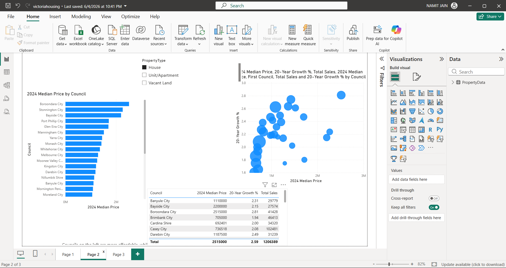
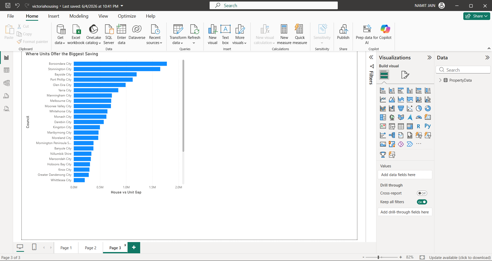

# 🏠 Victoria Housing Price Analysis

An interactive Power BI dashboard analysing Victorian property prices from 2004 to 2025, comparing price growth across council areas, regions (Metropolitan vs Regional Victoria) and property types.

## 📊 Dashboard Preview

### Market Overview

### Price Trends & Growth

### Council-Level Insights

## 📄 Report Pages

1. **Market Overview:** KPI summary and regional comparisons.
2. **Price Trends & Growth:** Median prices and year-over-year growth over time.
3. **Council-Level Insights:** Detailed comparison of individual council areas.

## 🗂️ Data Model

| Column | Description |
|---|---|
| Council | Local council area in Victoria |
| Region | Metropolitan or Regional Victoria |
| Year | Calendar year (2004–2025) |
| PropertyType | House, Unit, etc. |
| NumSales | Number of property sales |
| MedianPrice | Median sale price |
| MeanPrice | Average sale price |
| YoY_Median_Growth_Pct | Year-over-year % change in median price |
| Median_Index_2004base | Price index (2004 = 100) |
| IsAggregate | Flag for aggregated rows |
| IsPreliminary | Flag for preliminary data (2025 figures may be revised) |

## 🛠️ Tools Used

- **Power BI Desktop:** data modelling, DAX measures and report design
- **Excel / CSV:** source data

## 📁 Repository Contents

| File | Description |
|---|---|
| melbourne_council_property.csv | Main dataset (2004–2025) |
| victoria_council_property_2004_2025.xlsx | Excel version with additional worksheets |
| sheet1.png – sheet3.png | Dashboard screenshots |

## 🚀 How to Use

1. Clone or download this repository.
2. Open the dataset in Power BI Desktop or Excel.
3. Filter by region, council or property type to explore trends.

**Data source:** [e.g. Victorian Valuer-General, Victorian Property Sales Report]